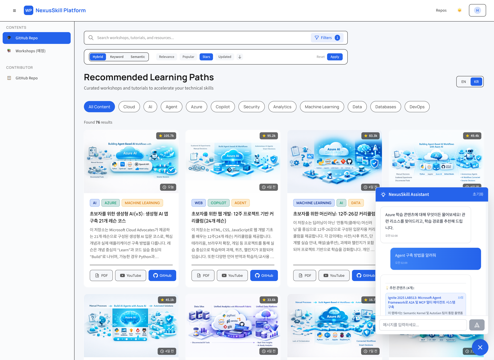

# NexusSkill

Microsoft & Azure 콘텐츠 학습 플랫폼

[](https://github.com/studydev/buildflow/actions/workflows/backend-ci.yml)
[](https://github.com/studydev/buildflow/actions/workflows/frontend-ci.yml)
[](https://github.com/studydev/buildflow/actions/workflows/deploy-dev.yml)
[](https://github.com/studydev/buildflow/actions/workflows/deploy-frontend.yml)

## 플랫폼 미리보기



*워크샵과 튜토리얼을 탐색하고 기술 역량을 가속화할 수 있는 큐레이션된 학습 경로를 제공합니다.*  
[Demo 접속하기](https://nexus.studydev.com/)

## 프로젝트 개요

NexusSkill은 GitHub 저장소를 분석하여 Microsoft 및 Azure 클라우드 개발 학습 콘텐츠를 자동으로 큐레이션하고, AI 기반 검색 및 추천 기능을 제공하는 플랫폼입니다.

### 주요 기능

| 기능 | 설명 | 상태 |
|------|------|------|
| GitHub 저장소 분석 | README, 메타데이터, 커밋 활동 자동 추출 | ✅ |
| AI 기반 콘텐츠 강화 | GPT-5.2를 활용한 요약, 난이도, 학습 성과 생성 | ✅ |
| 다국어 지원 | 한국어 자동 번역 (Localization Pipeline) | ⏳ |
| 자산 자동 생성 | 썸네일, OG 이미지 자동 생성 | ⏳ |
| 하이브리드 검색 | Azure AI Search 기반 키워드 + 벡터 검색 | ⏳ |
| AI 챗봇 | 의미 기반 콘텐츠 검색 및 추천 챗봇 | ⏳ |

## 아키텍처 개요

```
┌─────────────────────────────────────────────────────────────────┐
│                         NexusSkill                              │
├──────────────────────┬──────────────────────────────────────────┤
│  Frontend            │  Vue 3 + TypeScript + Vite               │
│  (Azure SWA)         │  Pinia 상태관리, Tailwind CSS              │
├──────────────────────┼──────────────────────────────────────────┤
│  Backend API         │  FastAPI + Python 3.9                    │
│  (Container Apps)    │  Cosmos DB, Azure OpenAI                 │
├──────────────────────┼──────────────────────────────────────────┤
│  Data Pipelines      │  Container Apps Jobs                     │
│  (Dev Only)          │  Analysis, Enrichment, Indexing          │
└──────────────────────┴──────────────────────────────────────────┘
```

## 프로젝트 구조

```
buildflow/
├── backend/              # FastAPI 백엔드 → backend/README.md
├── frontend/             # Vue 3 프론트엔드
├── infra/                # Azure Bicep IaC → infra/README.md
├── .github/workflows/    # CI/CD 워크플로우 → .github/workflows/README.md
└── docs/                 # 추가 문서
```

> 각 폴더의 상세 문서는 해당 폴더의 README.md를 참조하세요.

## 구현 현황

### 완료 기능

| 카테고리 | 항목 | 완료일 | 비고 |
|----------|------|--------|------|
| **인프라** | Azure Container Apps 배포 | 2026-01-21 | Dev 환경 |
| **인프라** | Azure Static Web Apps 배포 | 2026-01-21 | Frontend 호스팅 |
| **인프라** | Cosmos DB 설정 | 2026-01-21 | Serverless |
| **인프라** | Container Registry (ACR) | 2026-01-21 | Docker 이미지 저장 |
| **CI/CD** | Backend CI (Lint + Test) | 2026-01-21 | Ruff + pytest |
| **CI/CD** | Frontend CI (Lint + Test + Build) | 2026-01-21 | ESLint + Vitest + Vite |
| **CI/CD** | Deploy to Dev 파이프라인 | 2026-01-21 | Backend CI 성공 시 자동 배포 |
| **CI/CD** | Deploy Frontend 파이프라인 | 2026-01-21 | Azure SWA 자동 배포 |
| **Backend** | Health Check 엔드포인트 | 2026-01-21 | /health, /api/v1/health |
| **Backend** | Content CRUD API | 2026-01-21 | 기본 CRUD |
| **Backend** | GitHub 분석 파이프라인 | 2026-01-21 | 저장소 메타데이터 추출 |
| **Backend** | OTP 이메일 인증 | 2026-01-22 | @microsoft.com, @github.com 도메인 |
| **Frontend** | 콘텐츠 그리드 UI | 2026-01-21 | ContentGrid 컴포넌트 |
| **Frontend** | 언어 토글 (EN/KR) | 2026-01-21 | LanguageToggle 컴포넌트 |
| **Frontend** | OTP 로그인 UI | 2026-01-22 | 이메일 입력 + OTP 입력 모달 |

### ⏳ 예정된 기능

| 카테고리 | 항목 | 우선순위 | 예상 일정 |
|----------|------|----------|-----------|
| **인프라** | Azure AI Search 통합 | 높음 | - |
| **인프라** | Azure Service Bus 설정 | 중간 | - |
| **인프라** | Prod 환경 배포 | 낮음 | 추후 결정 |
| **Backend** | Enrichment Pipeline (AI 강화) | 높음 | - |
| **Backend** | Localization Pipeline (번역) | 중간 | - |
| **Backend** | Asset Generation Pipeline | 중간 | - |
| **Backend** | 하이브리드 검색 API | 높음 | - |
| **Backend** | AI Assistant (RAG 채팅) | 중간 | - |
| **Frontend** | AI 어시스턴트 UI | 중간 | - |
| **Frontend** | 고급 검색 필터 | 중간 | - |

## 🚀 빠른 시작

### 로컬 개발

```bash
# Frontend
npm install
npm run dev

# Backend
cd backend
pip install -r requirements.txt
uvicorn app.main:app --reload --port 8001
```

### 상세 가이드

- **인프라 배포**: [infra/README.md](infra/README.md)
- **Backend 개발**: [backend/README.md](backend/README.md)
- **Frontend 개발**: [frontend/README.md](frontend/README.md)
- **CI/CD 워크플로우**: [.github/workflows/README.md](.github/workflows/README.md)

## 🛠️ 기술 스택

| 영역 | 기술 |
|------|------|
| Frontend | Vue 3, TypeScript, Vite, Pinia, Tailwind CSS |
| Backend | FastAPI, Python 3.9, Pydantic v2 |
| Database | Azure Cosmos DB (Serverless) |
| Hosting | Azure Container Apps, Azure Static Web Apps |
| CI/CD | GitHub Actions |
| IaC | Bicep |

## 📄 라이선스

MIT License
